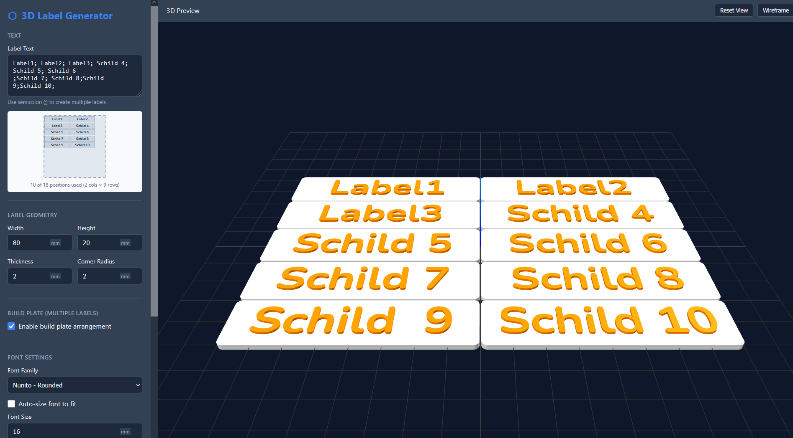

# 3D Label Generator

Web-based application for creating customizable 3D labels. Made with CadQuery and Three.js.

Try out [here](https://huggingface.co/spaces/KristianKrause/3d-label-generator).



## Features

- **Customizable Labels**: Configure width, height, thickness, corner radius
- **Font Options**: 9 sans-serif fonts with bold/italic support (Osifont, Overpass, Roboto, Open Sans, Lato, Montserrat, Source Sans 3, Nunito, Poppins)
- **Text Modes**: Extruded (raised) or subtracted (engraved) text
- **Multi-Label Support**: Create multiple labels on a single build plate
- **3D Preview**: Interactive Three.js viewer with pan, rotate, zoom
- **Export Formats**: STEP, STL

## Installation

### 1. Create Virtual Environment

```bash
python -m venv venv

# Windows
venv\Scripts\activate

# Linux/Mac
source venv/bin/activate
```

### 2. Install Dependencies

```bash
pip install -r requirements.txt
```

**Note**: CadQuery requires additional setup. Install via conda for best results:

```bash
conda install -c conda-forge cadquery
```

Or use the OCP build:

```bash
pip install cadquery-ocp
```

### 3. Download Fonts

```bash
python download_fonts.py
```

### 4. Run the Application

```bash
python app.py
```

Open your browser at: http://localhost:5000

## Docker

```bash
# Build from local files
docker build -t 3d-label-generator .

# Or build directly from GitHub
docker build -t 3d-label-generator https://github.com/qwertz098/3d_label_generator.git

# Run the container
docker run -p 5000:5000 3d-label-generator

# With docker-compose
docker-compose up
```

The Docker image includes:
- All Python dependencies (CadQuery, Flask)
- Pre-downloaded fonts (9 font families)
- Automatic font registration with OpenCASCADE
- Health check endpoint at `/api/status`

## Usage

1. **Enter Text**: Type your label text (use `;` to create multiple labels)
2. **Configure Geometry**: Set width, height, thickness, and corner radius
3. **Choose Font**: Select font family, size, and style (bold/italic)
4. **Select Text Mode**: Extruded (raised) or subtracted (engraved)
5. **Preview**: Click "Update Preview" to see 3D visualization
6. **Export**: Download as STEP or STL

### Multiple Labels

Enable "Build plate arrangement" and separate texts with semicolons:

```
Label 1; Label 2; Label 3
```

Labels will be automatically arranged on the build plate.

## API Endpoints

- `GET /` - Main web interface
- `GET /api/fonts` - List available fonts
- `POST /api/preview` - Generate 3D preview mesh data
- `POST /api/export` - Export label to file format
- `GET /api/status` - Check system status

## Requirements

- Python 3.9+
- CadQuery 2.4+
- Flask 3.0+
- Modern web browser with WebGL support

## License

MIT License
